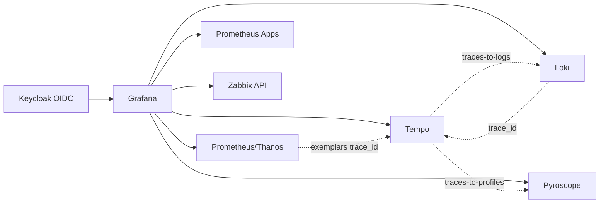

# Grafana GitOps

Grafana Operator e instância Grafana declarativos para OpenShift Local. O
overlay integra Prometheus/Thanos, Prometheus Apps, Loki, Tempo, Pyroscope e
Zabbix e provisiona dashboards sem armazenar credenciais no Git.


## Arquitetura



O Grafana é a camada de visualização e correlação: autentica via Keycloak,
consulta métricas de plataforma no Prometheus/Thanos, métricas de aplicações no
Prometheus Apps, logs no Loki, traces no Tempo, profiles no Pyroscope e dados
operacionais no Zabbix.

Cada overlay cria um PVC `ReadWriteOnce` de 5 GiB para persistir
`/var/lib/grafana`. Isso mantém o banco interno SQLite, estado de plugins,
datasources aplicados pelo Operator e dashboards após restart do pod. Sem esse
PVC, o Grafana volta vazio depois de reiniciar e depende de uma nova
reconciliação dos CRs `GrafanaDatasource`/`GrafanaDashboard`.

Os overlays instalam os plugins `grafana-llm-app` e
`alexanderzobnin-zabbix-app` via `GF_INSTALL_PLUGINS`. O primeiro habilita
extensões baseadas em LLM dentro do Grafana, como recursos de explicação e
assistência em painéis quando um provedor/modelo for configurado. O segundo
habilita o datasource Zabbix. Como app plugins do Grafana precisam ser
habilitados depois de instalados, o overlay inclui um Job `PostSync` do Argo CD
e o script `scripts/bootstrap-grafana-oauth.sh` também faz esse enable via API
de forma idempotente. Chaves de provedores LLM não são versionadas neste
repositório. Os apps nativos de drilldown são declarados em `[plugins].preinstall`
e `preinstall_auto_update=false` evita que o Grafana tente atualizar plugins
bundled, como `elasticsearch`, em diretórios read-only da imagem.

## Correlação de observabilidade

```text
Prometheus Apps --exemplar--> Tempo
Tempo ----------trace------> Loki + Prometheus Apps
Tempo ----------trace------> Pyroscope
Loki -------trace_id---> Tempo
```

Os datasources possuem UIDs estáveis e correlações provisionadas:

- exemplares de métricas abrem o trace correspondente no Tempo;
- spans oferecem links para logs e métricas do serviço;
- `trace_id` encontrado no Loki abre o trace;
- Tempo usa Prometheus Apps para métricas RED e Service Graph;
- Tempo usa Pyroscope para traces-to-profiles quando existirem profiles com
  labels compatíveis;
- dashboards oficiais Keycloak de capacidade e troubleshooting são importados.
- dashboard exemplo oficial do Argo CD é importado do repositório upstream e usa
  as métricas expostas pelo OpenShift GitOps Operator.

O Drilldown do Grafana usa exploração sem consulta manual. Para traces, ele
depende de RED/TraceQL Metrics no Tempo e das correlações do datasource. Este
repo provisiona `nodeGraph`, `serviceMap`, `tracesToLogsV2`, `tracesToMetrics`
e `tracesToProfiles`. No CRC, o streaming de busca/métricas do datasource Tempo
fica desabilitado porque o gateway multitenant do Tempo/OpenShift não expõe os
canais gRPC/HTTP2 esperados pelo Grafana Live; as consultas HTTP padrão de
trace/search continuam funcionando. As métricas RED contínuas vêm do connector
`span_metrics` do `opentelemetry-gitops`; Service Graph só mostra dados quando
existirem métricas de grafo no Prometheus, geradas por Tempo metrics-generator,
Grafana Alloy ou outro pipeline compatível.

Diagnóstico detalhado de Traces Drilldown, Service structure, Logs Drilldown e
Profiles Drilldown: [docs/DRILLDOWN.md](docs/DRILLDOWN.md).

## Deploy

Pré-requisitos: OpenShift, `oc`, Kustomize, OpenShift Monitoring/Thanos,
Prometheus Apps e os backends desejados.

Crie o Secret OIDC consumido pelo Grafana a partir do client `grafana` existente
no realm `observability` do Keycloak:

```bash
cp .env.example .env
scripts/bootstrap-grafana-oauth.sh
```

Esse mesmo script também tenta habilitar/pinar o app plugin
`alexanderzobnin-zabbix-app` quando a Route e o Secret admin do Grafana já
existem. Se você executar o bootstrap antes do Grafana subir, reexecute-o após o
deploy ou aguarde o Job `grafana-enable-zabbix-app-plugin` rodar como hook
`PostSync` do Argo CD.

O datasource Zabbix usa um usuário técnico criado pelo repositório
`zabbix-gitops`. Se precisar criar manualmente:

```bash
oc create namespace grafana --dry-run=client -o yaml | oc apply -f -
oc -n grafana create secret generic zabbix-datasource \
  --from-literal=username="${ZABBIX_USER}" \
  --from-literal=password="${ZABBIX_PASSWORD}" \
  --dry-run=client -o yaml | oc apply -f -

oc apply -k overlays/desenvolvimento
oc -n grafana get grafana,grafanadatasource,grafanadashboard,route
```

### Secrets consumidos

| Secret | Namespace | Chaves | Criado por |
|---|---|---|---|
| `grafana-oauth` | `grafana` | `client-id`, `client-secret` | `scripts/bootstrap-grafana-oauth.sh` |
| `prometheus-ocp-token` | `grafana` | `token` | manifest `rules/openshift-monitoring-access.yaml` |
| `grafana-loki-token` | `grafana` | `token` | manifest `rules/loki-access.yaml` |
| `grafana-tempo-token` | `grafana` | `token` | `tempo-gitops` |
| `zabbix-datasource` | `grafana` | `username`, `password` | `zabbix-gitops/scripts/bootstrap-zabbix.sh` |

Rotação do OAuth: reexecute `scripts/bootstrap-grafana-oauth.sh` após rotacionar
o client secret no Keycloak e sincronize/reinicie o Grafana se necessário.

Os datasources usam UIDs estáveis: `prometheus-ocp`, `prometheus-apps`, `loki`,
`tempo`, `pyroscope` e `zabbix`.

Plugins provisionados ou esperados:

| Plugin | Uso | Origem |
|---|---|---|
| `grafana-llm-app` | extensões LLM do Grafana | instalado por `GF_INSTALL_PLUGINS` |
| `alexanderzobnin-zabbix-app` | datasource e dashboards Zabbix | instalado por `GF_INSTALL_PLUGINS` e habilitado pelo hook/script |
| `grafana-pyroscope-app` | Profiles Drilldown | imagem/ambiente Grafana |
| `grafana-exploretraces-app` | Traces Drilldown | imagem/ambiente Grafana |
| `grafana-lokiexplore-app` | Logs Drilldown | imagem/ambiente Grafana |
| `grafana-metricsdrilldown-app` | Metrics Drilldown | imagem/ambiente Grafana |

Valide a versão efetivamente instalada:

```bash
oc -n grafana exec deploy/grafana-deployment -- grafana server --version
oc -n grafana exec deploy/grafana-deployment -- grafana cli plugins ls
oc -n grafana get pvc
```

Valide o app Zabbix no Grafana:

```bash
scripts/bootstrap-grafana-oauth.sh
```

O script não imprime secrets. Ele usa a API do Grafana apenas para habilitar o
plugin quando `GRAFANA_ENABLE_ZABBIX_APP_PLUGIN=true`.

O nome do Deployment pode variar com a versão do Operator; descubra-o com
`oc -n grafana get deploy`.

## Estrutura

```text
base/                         namespaces e instalação OLM do Operator
overlays/desenvolvimento/     instância, acesso, datasources e dashboards para CRC
overlays/aceite/              homologação, com hosts e secrets parametrizados
overlays/producao/            produção, com placeholders de domínio e hardening
docs/                         documentação operacional por ambiente
```

Os dashboards aplicados ficam dentro do overlay correspondente, organizados por
solução em `overlays/<ambiente>/dashboards/{openshift,kubernetes,gitops,identity,prometheus}`.

## Datasources em dashboards

Dashboards importados do Grafana.com ou de URLs externas devem declarar
explicitamente o datasource esperado no `GrafanaDashboard.spec.datasources`.
Esse campo substitui inputs como `DS_PROMETHEUS` pelo datasource real criado
no cluster.

Padrão usado neste repositório:

| Família de dashboard | Input | Datasource |
|---|---|---|
| Kubernetes/OpenShift/Prometheus | `DS_PROMETHEUS` | `Prometheus-OCP` |
| Argo CD/OpenShift GitOps | `DS_PROMETHEUS` | `Prometheus-OCP` |
| Keycloak/aplicações instrumentadas | `DS_PROMETHEUS` | `Prometheus-Apps` |

Dashboards JSON locais devem preferir o UID estável do datasource
(`prometheus-ocp`, `prometheus-apps`, `tempo`, `pyroscope`, `loki`, `zabbix`)
em vez do nome visual. Assim a importação continua funcionando mesmo que o
título exibido no Grafana mude.

## Dashboards provisionados

| Dashboard | Origem | Datasource | Dependências |
|---|---|---|---|
| OpenShift Local - Overview | JSON local versionado | `prometheus-ocp` | OpenShift Monitoring e kube-state-metrics |
| Kubernetes / Views / Global | Grafana.com `15757` rev `43` | `Prometheus-OCP` | métricas Kubernetes/OpenShift |
| Kubernetes / Views / Namespaces | Grafana.com `15758` rev `46` | `Prometheus-OCP` | métricas Kubernetes/OpenShift |
| Kubernetes / Views / Nodes | Grafana.com `15759` rev `40` | `Prometheus-OCP` | métricas Kubernetes/OpenShift |
| Kubernetes / Views / Pods | Grafana.com `15760` rev `39` | `Prometheus-OCP` | métricas Kubernetes/OpenShift |
| Kubernetes / System / API Server | Grafana.com `15761` rev `21` | `Prometheus-OCP` | métricas do API server |
| Kubernetes / System / CoreDNS | Grafana.com `15762` rev `22` | `Prometheus-OCP` | métricas CoreDNS |
| Prometheus | Grafana.com `19105` rev `9` | `Prometheus-OCP` | métricas do Prometheus/Thanos |
| Argo CD Overview | `argoproj/argo-cd/examples/dashboard.json` | `prometheus-ocp` | ServiceMonitors do OpenShift GitOps |
| Keycloak Capacity Planning | `keycloak/keycloak-grafana-dashboard` | `prometheus-apps` recomendado | ServiceMonitor do Keycloak e métricas de eventos |
| Keycloak Troubleshooting | `keycloak/keycloak-grafana-dashboard` | `prometheus-apps` recomendado | ServiceMonitor do Keycloak e métricas de eventos |
| Zabbix plugin dashboards | app `alexanderzobnin-zabbix-app` | `zabbix` | importação pelo próprio plugin/datasource |

As pastas são provisionadas por `GrafanaFolder`: OpenShift, Kubernetes,
GitOps/Argo CD, Identidade/Keycloak, Observability Platform,
Profiles/Pyroscope e Zabbix.

Drilldown preparado:

- Prometheus → Tempo via exemplares `trace_id`;
- Tempo → Loki por `trace_id` e `service.name`;
- Loki → Tempo por campos `trace_id`/`traceId`;
- Tempo → Prometheus Apps via `tracesToMetrics` usando as métricas
  `traces_span_metrics_*` geradas pelo OpenTelemetry Collector;
- Service Graph fica configurado para usar `prometheus-apps`, mas depende das
  métricas `traces_service_graph_*`; o Red Hat OpenTelemetry Collector 0.152.1
  validado no CRC não inclui connector `servicegraph`, então essa parte fica
  documentada como evolução para TempoStack/metrics-generator ou Alloy;
- Profiles Drilldown usa o datasource `pyroscope` e `tracesToProfiles` no
  Tempo em nível de serviço/namespace. Sem aplicações instrumentadas, o
  datasource fica disponível, mas não haverá flamegraphs úteis. O link
  `tracesToProfiles` define um tipo padrão para navegação a partir de traces;
  tipos adicionais como wall, alloc e lock aparecem no Profiles Drilldown
  quando a aplicação enviar esses perfis para o Pyroscope;
- Argo CD → aplicações/workloads via labels e filtros do dashboard upstream;
- Zabbix → Host group/Host/Item pelo plugin `alexanderzobnin-zabbix-app`.

## Segurança

- o token do Thanos fica em Secret e recebe somente leitura;
- o OAuth usa Keycloak Generic OAuth/OIDC, grupos do realm e `role_attribute_path`;
- cookies seguros, CSP e HSTS ficam habilitados no overlay CRC para aproximar o
  comportamento local de um ambiente real;
- TLS interno é ignorado apenas no perfil local; distribua a CA em produção;
- use External Secrets/Sealed Secrets para Zabbix e credenciais administrativas;
- restrinja a Route com autenticação e RBAC apropriados;
- fixe versões do Operator/Grafana após homologação.

## Diagnóstico

```bash
oc kustomize overlays/desenvolvimento >/tmp/grafana.yaml
oc apply --dry-run=server -f /tmp/grafana.yaml
oc -n grafana logs -l app=grafana --tail=100
```

### Tempo no CRC/OpenShift Local

O datasource Tempo usa o gateway do `tempo-gitops` com token de ServiceAccount
em `grafana/grafana-tempo-token`.

No CRC atual, a busca HTTP de traces funciona pelo caminho:

```text
https://tempo-tempo-monolithic-gateway.tempo.svc.cluster.local:8080/api/traces/v1/dev/tempo
```

O streaming do datasource Tempo fica desligado. Quando habilitado, o Grafana
abre canais live/gRPC para `Search` e `MetricsQueryRange`; o gateway
multitenant responde `404 text/plain` para esses canais, gerando mensagens como:

```text
rpc error: code = Unimplemented desc = unexpected HTTP status code received from server: 404
```

Valide o estado operacional do Tempo pelo Argo CD, pods, Service e por consultas
reais de trace. Se precisar de streaming, use um endpoint Tempo/query-frontend
que suporte gRPC/HTTP2 ponta a ponta ou configure acesso direto com os
certificados mTLS exigidos pelo serviço interno.

Referências: [Grafana Drilldown](https://grafana.com/docs/grafana/latest/visualizations/simplified-exploration/),
[Tempo datasource](https://grafana.com/docs/grafana/latest/datasources/tempo/),
[provisionamento do datasource Tempo](https://grafana.com/docs/grafana/latest/datasources/tempo/configure-tempo-data-source/provision/)
e [Service Graph](https://grafana.com/docs/grafana/latest/datasources/tempo/service-graph/).
Para LLM no Grafana, veja o plugin oficial
[`grafana-llm-app`](https://grafana.com/grafana/plugins/grafana-llm-app/).
Para o enable automático de app plugins, veja o provisionamento oficial de
plugins do Grafana:
<https://grafana.com/docs/grafana/latest/administration/provisioning/#plugins>.
Para autenticação, veja a documentação oficial de
[Keycloak OAuth2 no Grafana](https://grafana.com/docs/grafana/latest/setup-grafana/configure-access/configure-authentication/keycloak/)
e [Generic OAuth](https://grafana.com/docs/grafana/latest/setup-grafana/configure-access/configure-authentication/generic-oauth/).

### Logs Drilldown e LokiStack do OpenShift

O datasource Loki aponta para o gateway suportado pelo LokiStack/OpenShift
Logging:

```text
https://loki-gateway-http.openshift-logging.svc.cluster.local:8080/api/logs/v1/application
```

Esse caminho responde consultas LogQL, `query_range` e `labels`, mas no CRC
validado o gateway retorna `404` para endpoints usados por partes do Grafana
Logs Drilldown, como `detected_labels` e `detected_fields`. Portanto, logs e
trace-to-logs funcionam, mas a experiência completa de Logs Drilldown depende
de uma API Loki compatível sendo exposta ao Grafana.

Para eliminar o `404`, as opções seguras são:

- atualizar Loki/Grafana quando o gateway do LokiStack expuser os endpoints
  exigidos pelo Logs Drilldown;
- usar um Loki self-managed compatível com Logs Drilldown para laboratório;
- configurar acesso direto ao componente query frontend apenas se os requisitos
  de mTLS/RBAC do Operator forem atendidos.

Não aponte o Grafana para serviços internos mTLS do LokiStack sem validar
certificados e suporte oficial; isso tende a quebrar autenticação do OpenShift
Logging.

## Ambientes e validação

```bash
oc kustomize overlays/desenvolvimento >/tmp/grafana-dev.yaml
oc kustomize overlays/aceite >/tmp/grafana-aceite.yaml
oc kustomize overlays/producao >/tmp/grafana-prod.yaml
oc apply --dry-run=client -k overlays/desenvolvimento
```

`desenvolvimento` é o perfil CRC. `aceite` e `producao` usam placeholders
`.example.invalid`; substitua por Route/TLS/Keycloak reais do ambiente antes de
sincronizar pelo Argo CD. Mais detalhes: `docs/AMBIENTES.md`.
